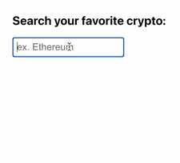
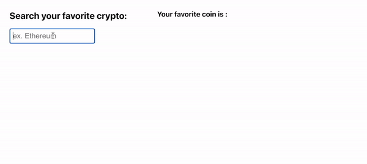

# incremental-searchbox-react-component

Search with a keyword and some of the closest results (using fuzzy search) will show.



[](https://www.npmjs.com/package/incremental-search) [](https://standardjs.com)

## Install

```bash
npm install --save incremental-search
```

## Usage

With React Component

```tsx
import React, { Component } from 'react'

import IncrementalSearchBox from 'incremental-search'
import 'incremental-search/dist/index.css'

class Example extends Component {
  render() {
    return <IncrementalSearchBox />
  }
}
```

With React hooks

```tsx
import React, { useState } from 'react'
import IncrementalSearchBox from 'incremental-search'

export default function App() {
  const [selectedOption, setSelectedOption] = useState(null)
  const [coins, setCoins] = React.useState([])

  return (
    <div className='App'>
      <IncrementalSearchBox
        options={coins}
        dataKey='name'
        style={undefined}
        onSelect={setSelectedOption}
      />
    </div>
  )
}
```

## Running Example in Local



```
npm start
```

open a different tab

```
cd example
npm start
```

## License

MIT © [yuriko627](https://github.com/yuriko627)
