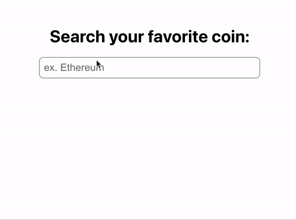

# crypto-fuzzy-search-react-component

Search your favorite crypto and some of the closest results (using fuzzy search) will show.



[](https://www.npmjs.com/package/incremental-search) [](https://standardjs.com)

## Install

```bash
npm install --save incremental-search
```

## Usage

With React Component

```tsx
import React, { Component } from 'react'

import IncrementalSearchBox from 'incremental-search'
import 'incremental-search/dist/index.css'

class Example extends Component {
  render() {
    return <IncrementalSearchBox />
  }
}
```

With React hooks

```
<!-- import React, { useState } from 'react';
import Select from 'react-select';

const options = [
  { value: 'chocolate', label: 'Chocolate' },
  { value: 'strawberry', label: 'Strawberry' },
  { value: 'vanilla', label: 'Vanilla' },
];

export default function App() {
  const [selectedOption, setSelectedOption] = useState(null);

  return (
    <div className="App">
      <Select
        defaultValue={selectedOption}
        onChange={setSelectedOption}
        options={options}
      />
    </div>
  );
} -->
```

## License

MIT © [yuriko627](https://github.com/yuriko627)
